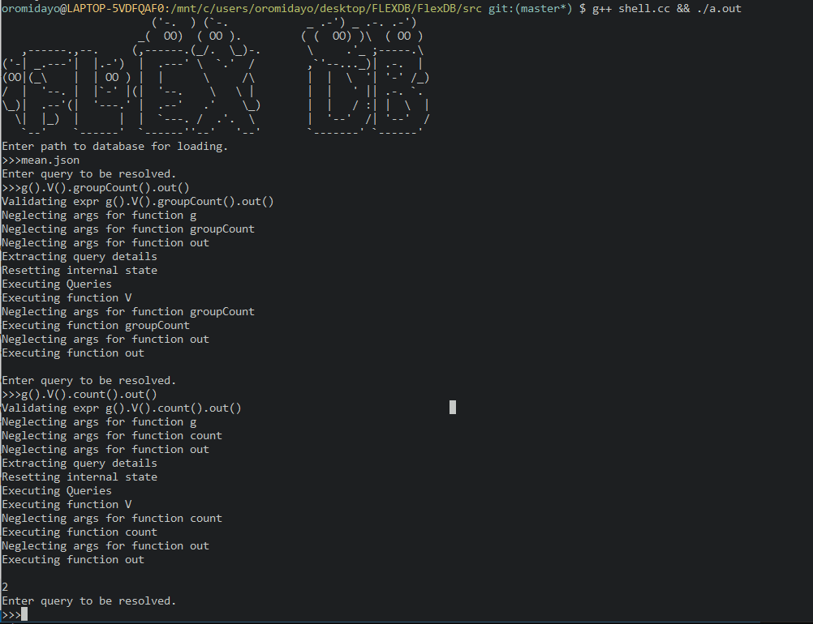

## A Toy JSON Based Graph Database written in C++.

Features ⚡⚡
- Graph Serialization and Deserialization.
- Tables which allow Nodes and Edges to store data liberally (hence the Flex).
- Query Parsing, Validation and Execution using a Gremlin Based Language.
- Mutation, Inference and other basic operations to work with the database.
- REPL(A Shell) (WIP).
- Graph Traversal Operations (WIP).
- A Qt based Frontend (Maybe)
- Python Bindings?

Issues 
- no real entry point to the program (you have to write code or use the incomplete shell).
- some basic functions are not implemented ( but the meaty graph stuff is).
- Lack of uniformity, cleanness and good pratices in the code. It is my first C++ program and I have not refactored it.
